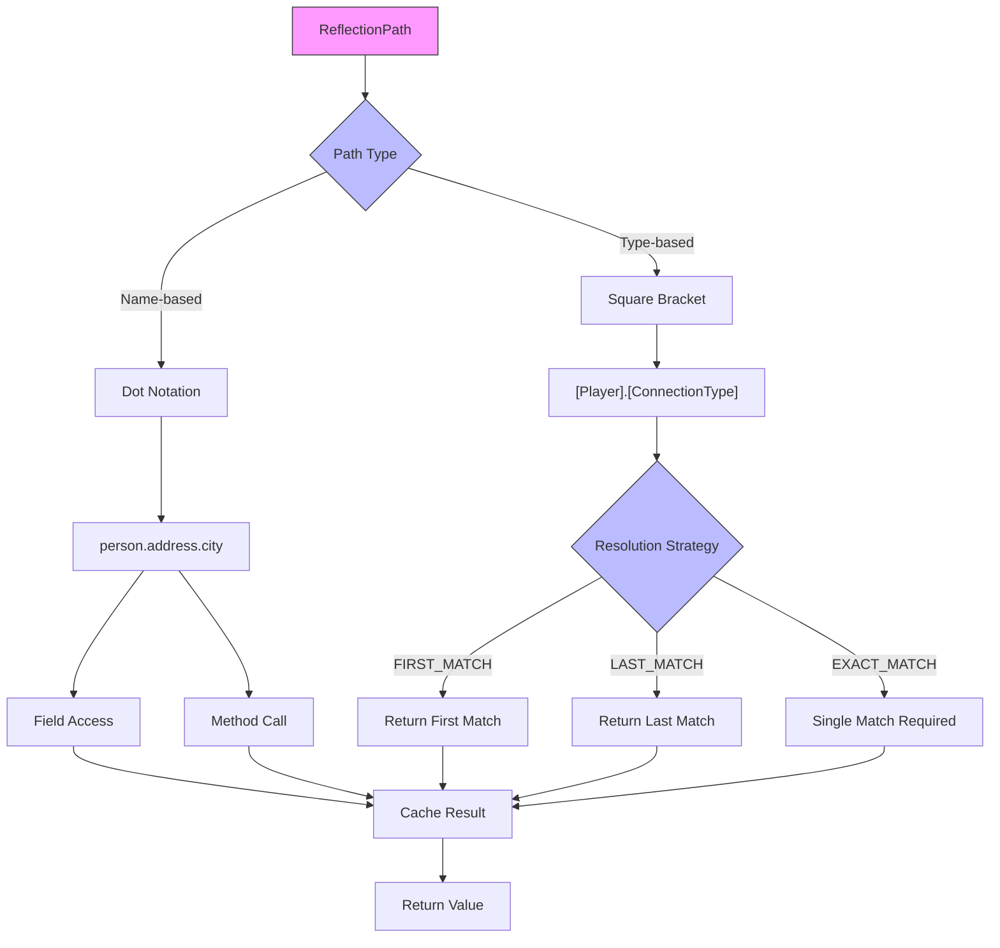

<p align="center">
    
</p>

# ReflectionPath  

ReflectionPath is a Java utility that provides type-safe reflection capabilities using intuitive path expressions.
It supports both traditional dot-notation and type-based path expressions for accessing fields and methods.

## Features

- Two path expression styles:
    - Name-based: `person.address.city`
      - Quick, human readable access to fields and methods
    - Type-based: `[Entity].[Location].[Place]`
      - Easy access to fields and methods by type, to resolve paths dynamically at runtime when you don't know the exact name (e.g. in an obfuscated environment)
- Array type support: `[Item[]]`
- Multiple resolution strategies for type-based paths
- Thread-safe with path caching
- Superclass member resolution

## Usage
### Basic Examples

```java
// Name-based field access
ReflectionPath path = new ReflectionPath("person.address.city");
String city = path.getAs(person, String.class);

// Type-based access
ReflectionPath typePath = new ReflectionPath("[Player].[ConnectionType]");
ConnectionType type = typePath.getAs(player, ConnectionType.class);

// Method invocation
ReflectionPath methodPath = new ReflectionPath("getName");
String name = methodPath.getAs(player, String.class);
```

### Resolution Strategies

When using type-based paths, you can specify how to handle multiple matching members:

```java
// First match (default)
ReflectionPath path1 = new ReflectionPath("[String]", PathResolutionStrategy.FIRST_MATCH);

// Last match
ReflectionPath path2 = new ReflectionPath("[String]", PathResolutionStrategy.LAST_MATCH);

// Exact match (throws exception if multiple matches found)
ReflectionPath path3 = new ReflectionPath("[String]", PathResolutionStrategy.EXACT_MATCH);
```

### Array Support

```java
// Access array fields
ReflectionPath arrayPath = new ReflectionPath("[String[]]");
String[] inventory = arrayPath.getAs(player, String[].class);
```

### Advanced Features

- Automatic superclass traversal
- Cached path resolution
- Configurable toString() method handling
- Thread-safe implementation
- Comprehensive error handling with ReflectionException

## Error Handling

ReflectionPath provides clear error messages for common scenarios:

- Invalid paths
- Type mismatches
- Null targets
- Access violations
- Resolution strategy conflicts

## Example flow


The diagram illustrates ReflectionPath's core functionality for accessing object members through reflection. It shows two main path resolution approaches: name-based using dot notation (e.g., person.address.city) and type-based using square brackets (e.g., [Player].[ConnectionType]). Both approaches lead to either field access or method calls, with type-based resolution offering three strategies: FIRST_MATCH, LAST_MATCH, and EXACT_MATCH. All results are cached before being returned to improve performance.

## Installation

Add the following dependency to your project:

```xml
<dependency>
    <groupId>dev.pixelib</groupId>
    <artifactId>reflection-path</artifactId>
    <version>1.0.0</version>
</dependency>
```

## Contributing

Contributions are welcome! Please feel free to submit a Pull Request.

